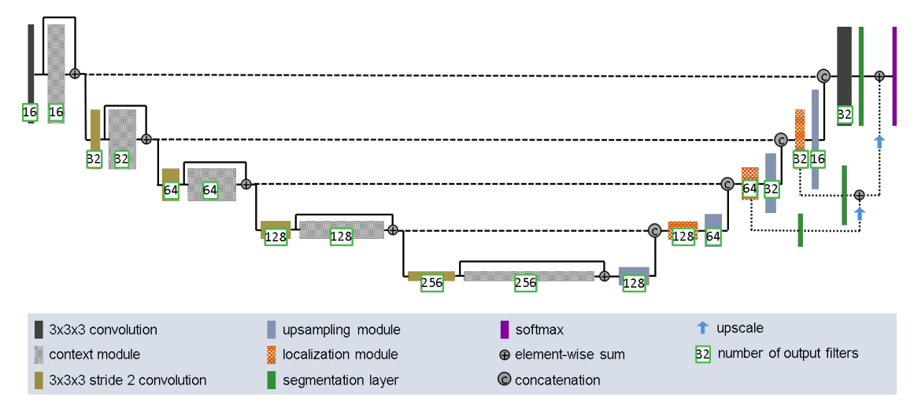

# OASIS Brain Data Segmentation

***Implemented by Quinn Horton (46975919)***

## Problem Description

This implementation addresses the problem of segmenting the 2D OASIS Brain Data following an Improved UNet architecture with the intention of being able to identify / isolate tumours. This problem, and others like it, are important to the field of medicine as the proactive detection of tumours and other such growths can be instrumental in the prevention of / early intervention against many life-threatening conditions.

### Design Architecture

The implementation leverages from the design architecture described within the paper "Brain Tumor Segmentation and Radiomics Survival Prediction: Contribution to the BRATS 2017 Challenge" by Isensee, et al.



### Project Structure

The project is set about in the following files:
- ***dataset.py:*** Used to load in the training and ground truth data values.
- ***modules.py:*** The implementation of the core model and all constituent layers / modules.
- ***train.py:*** Runs the training system for the model and saves the model weights.
- ***predict.py:*** Used to put the model into action and apply the trained model.

## Dependencies

This has been developed using python version 3.13.9, and relies on the following other dependencies:
- pytorch ('torch', v2.9.0)
- torchvision (v0.24.0)
- pillow ('PIL', v11.3.0)
- dotenv ('python-dotenv', v1.1.0)

## Setup

Once all dependencies above have been installed, then begin by acquiring a local copy of the relevant OASIS dataset and setting up the relevant environment variables for the path. If running the program on rangpur, this can simply be achieved by navigating into the `oasis_segmentation_QuinnHorton` directory and running the following command:
```bash
echo "OASIS_PATH=/home/groups/comp3710/OASIS" >> .env
```

Otherwise, if this is being run on a local machine, first login to the rangpur server and create an archive of the dataset, which can be done with:
```bash
cd /home/groups/comp3710/OASIS
zip ~/.OASIS_DATA *
```

Then, exit the server and copy the archive onto the local machine using secure copy:
```bash
scp username@rangpur.labs.eait.uq.edu.au:~/OASIS_DATA.zip local-filepath
```

Finally, extract the contents of this archive into the desired location and create the required path environment variable:
```bash
echo "OASIS_PATH=/path/to/the/dataset" >> .env
```

Regardless of system, the other environment variables pertaining to the folder structure should also be configured. Assuming default values, this can be achieved using:
```bash
echo "TRAINING_FOLDER=keras_png_slices_train" >> .env
echo "TESTING_FOLDER=keras_png_slices_test" >> .env
echo "VALIDATION_FOLDER=keras_png_slices_validate" >> .env
echo "TRAINING_SEG_FOLDER=keras_png_slices_seg_train" >> .env
echo "TESTING_SEG_FOLDER=keras_png_slices_seg_test" >> .env
echo "VALIDATION_SEG_FOLDER=keras_png_slices_seg_validate" >> .env
```
